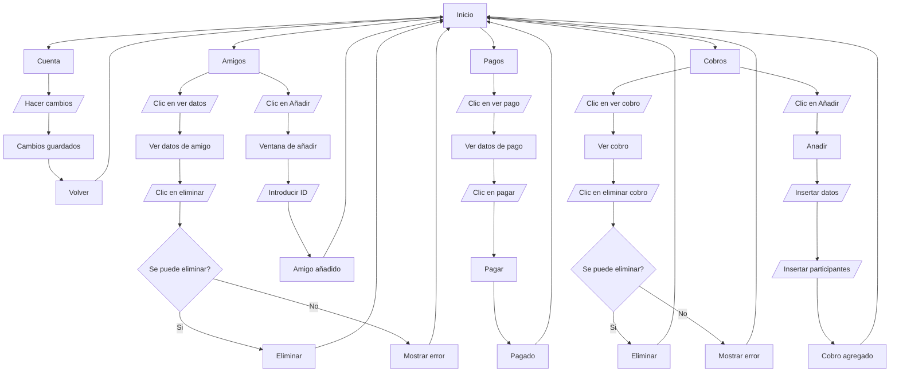

```mermaid
flowchart TD
  Inicio[Inicio]

  %% Cuenta
  Inicio --> Cuenta[Cuenta]
  Cuenta --> HC[/"Hacer cambios"/]
  HC --> CambiosGuardados[Cambios guardados]
  CambiosGuardados --> Volver[Volver]
  Volver --> Inicio

  %% Amigos
  Inicio --> Amigos[Amigos]

  Amigos --> VerDatosClick[/"Clic en ver datos"/]
  VerDatosClick --> VerDatos[Ver datos de amigo]
  VerDatos --> ClicEliminar[/"Clic en eliminar"/]
  ClicEliminar --> PuedeEliminar{Se puede eliminar?}
  PuedeEliminar -->|Si| Eliminar[Eliminar]
  PuedeEliminar -->|No| MostrarErrorEliminar[Mostrar error]
  Eliminar --> Inicio
  MostrarErrorEliminar --> Inicio

  Amigos --> ClicAnadir[/"Clic en Añadir"/]
  ClicAnadir --> VentanaAnadir[Ventana de añadir]
  VentanaAnadir --> IntroducirID[/"Introducir ID"/]
  IntroducirID --> AmigoAnadido[Amigo añadido]
  AmigoAnadido --> Inicio

  %% Pagos
  Inicio --> Pagos[Pagos]
  Pagos --> ClicVerPago[/"Clic en ver pago"/]
  ClicVerPago --> VerPago[Ver datos de pago]
  VerPago --> ClicPagar[/"Clic en pagar"/]
  ClicPagar --> Pagar[Pagar]
  Pagar --> Pagado[Pagado]
  Pagado --> Inicio

  %% Cobros
  Inicio --> Cobros[Cobros]
  Cobros --> ClicVerCobro[/"Clic en ver cobro"/]
  ClicVerCobro --> VerCobro[Ver cobro]
  VerCobro --> ClicEliminarCobro[/"Clic en eliminar cobro"/]
  ClicEliminarCobro --> PuedeEliminarCobro{Se puede eliminar?}
  PuedeEliminarCobro -->|Si| EliminarCobro[Eliminar]
  PuedeEliminarCobro -->|No| MostrarErrorCobro[Mostrar error]
  EliminarCobro --> Inicio
  MostrarErrorCobro --> Inicio

  Cobros --> ClicAnadirCobro[/"Clic en Añadir"/]
  ClicAnadirCobro --> AnadirCobro[Anadir]
  AnadirCobro --> InsertarDatos[/"Insertar datos"/]
  InsertarDatos --> InsertarParticipantes[/"Insertar participantes"/]
  InsertarParticipantes --> CobroAgregado[Cobro agregado]
  CobroAgregado --> Inicio
```
